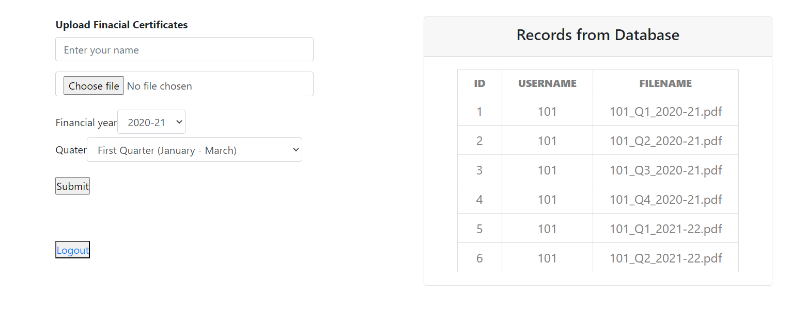

# Financial Certificates Handler

### Index:

- **Main page:** *index.php* (Consumer side interface)
- **Admin page:** *admin.php* (To upload financial certificates)
- **Authentication:** *authentication.php*, *login.html*
- **Database connection:** *connection.php*
- **PDF rendering:** *adminpdf.php*, *userpdf.php*

### Details:

This project is a PHP web application that allows admins to upload personal financial certificates of the consumers based on their PAN ID, Financial year, and quarter. Consumers with proper credentials can log in and access their PDF certificates through the navbar.

Financial certificate format: *[PAN-number]\_[quater-number]\_[financial-year].pdf*

Example: *1A247RF23_Q2_2021-22.pdf*

The years and quarters are limited to a few which are displayed statically, if the pdf file doesn't exist in the path mentioned the file doesn't render.

| Years   | Quaters |
| ------- | ------- |
| 2020-21 | Q1      |
| 2021-22 | Q2      |
| 2022-23 | Q3      |
|         | Q4      |

**Directory where PDFs are stored:** *'C:/pdf/[filename]'*
